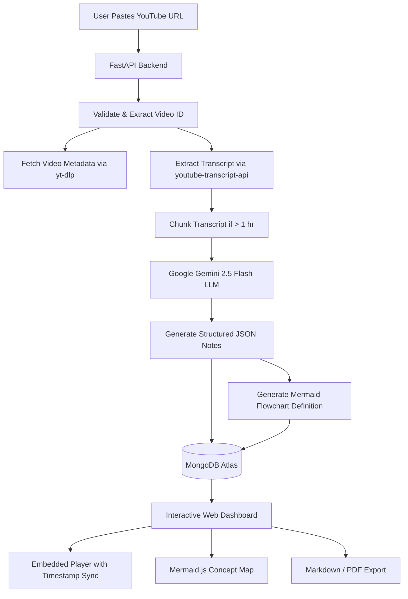

# 📒 LectureNotes — AI-Powered YouTube Lecture Notes & Concept Maps

[](https://lecturenotes-frontend.onrender.com)
[](https://fastapi.tiangolo.com)
[](https://ai.google.dev/)
[](https://www.mongodb.com/)
[](https://mermaid.js.org/)

> **Live Deployment:** [https://lecturenotes-frontend.onrender.com](https://lecturenotes-frontend.onrender.com)

**LectureNotes** is a full-stack web application that transforms educational YouTube videos into structured, hierarchical lecture notes and interactive visual concept maps in seconds using Google's Gemini 2.5 Flash LLM.

---

## 🎯 Problem Statement & What It Solves

### The Problem
- **Passive Learning & Information Overload**: Millions of students, developers, and researchers watch long video lectures, webinars, and tutorials. Retaining complex information from 30–90 minute videos without comprehensive notes is difficult.
- **Time-Consuming Manual Note-Taking**: Pausing, rewinding, and summarizing videos by hand disrupts focus and doubles the time needed to study.
- **Lack of Visual Concept Structuring**: Video content is linear, making it hard to see how foundational topics connect to advanced sub-topics at a glance.
- **Difficulty Revisiting Content**: Finding a specific formula, definition, or explanation often requires scrubbing through a video timeline blindly.

### The Solution: LectureNotes
LectureNotes automates the entire synthesis workflow:
1. **Instant Ingestion**: Simply paste any YouTube video link.
2. **Transcript Extraction**: Extracts complete captions and metadata automatically.
3. **Structured AI Synthesis**: Uses Google Gemini 2.5 Flash to convert raw transcripts into hierarchical notes with timestamps, key definitions, and takeaways.
4. **Visual Knowledge Graphs**: Generates dynamic mind-maps and flowcharts using Mermaid.js to visualize topic relationships.
5. **Interactive Playback & Timestamp Sync**: Click any timestamp in the notes to jump directly to that exact moment in the embedded video player.
6. **Searchable Knowledge Base**: Automatically categorizes and tags videos in a personal MongoDB library for rapid search and one-click Markdown/PDF export.

---

## ✨ Key Features

- ⚡ **Automated Transcript Extraction**: Fetches YouTube captions with fallback mechanisms to ensure high reliability.
- 🧠 **AI-Powered Structured Notes**:
  - Executive video summary (2–3 sentences)
  - Logical section breakdown based on content shifts
  - Detailed hierarchical bullet points
  - Highlighted **Key Terms** and definitions
  - Curated **Key Takeaways**
- 🗺️ **Interactive Flowcharts & Concept Maps**: Automatically creates visual Mermaid diagrams illustrating concept hierarchy and logical progression.
- ⏱️ **Timestamp-Synced Video Navigation**: Jump straight to relevant video segments by clicking timestamp badges within the notes.
- 🔍 **Search & Tag Filtering**: Real-time searching across video titles, channel names, and auto-generated topic tags.
- 📥 **Export to Markdown & PDF**: Download formatted notes with embedded Mermaid diagrams as `.md` files or print directly to PDF.
- 💬 **Interactive AI Study Tutor & Chat**: Ask questions, request concept quizzes, and get tailored explanations based on lecture notes and transcript context. All conversation history is automatically saved to MongoDB for continuous review.
- 🎨 **Modern Glassmorphic Dark UI**: Clean, responsive, accessible interface with subtle micro-animations and ambient glowing backdrops.

---

## 🏗️ Architecture & Pipeline



---

## 💻 Tech Stack

### Frontend
- **HTML5 & Vanilla CSS**: Custom modern design system featuring glassmorphism, responsive CSS grid, and CSS variables.
- **Vanilla JavaScript (ES6+)**: SPA architecture with hash-based routing (`#/` and `#/video/:id`), modal dialogs, and dynamic DOM rendering.
- **Mermaid.js (v11)**: Client-side vector diagram rendering for flowcharts and mind-maps.
- **YouTube IFrame API**: Embedded video player with bidirectional timestamp seeking.

### Backend
- **FastAPI (Python 3.12)**: High-performance asynchronous REST API.
- **Google GenAI SDK (`gemini-2.5-flash`)**: Fast, cost-efficient LLM for structured output parsing and flowchart generation.
- **Motor / PyMongo**: Asynchronous MongoDB driver for video metadata and note persistence.
- **youtube-transcript-api & yt-dlp**: Resilient transcript retrieval and metadata extraction.
- **Pydantic v2**: Data validation and response schemas.

### Database & Deployment
- **Database**: MongoDB Atlas (Cloud NoSQL database).
- **Deployment Platform**: [Render](https://render.com) using Infrastructure-as-Code (`render.yaml`).
- **Live URL**: [https://lecturenotes-frontend.onrender.com](https://lecturenotes-frontend.onrender.com)

---

## 🚀 Getting Started (Local Development)

### Prerequisites
- Python 3.12+
- MongoDB instance (local or MongoDB Atlas connection string)
- Google Gemini API Key ([Get one here](https://aistudio.google.com/))

---

### 1. Clone the Repository
```bash
git clone https://github.com/AnshulMandekar/YoutubeVideo-to-Transcript.git
cd YoutubeVideo-to-Transcript
```

---

### 2. Backend Setup
```bash
# Navigate to the backend directory
cd backend

# Create a virtual environment
python -m venv venv

# Activate virtual environment
# Windows:
venv\Scripts\activate
# macOS/Linux:
# source venv/bin/activate

# Install dependencies
pip install -r requirements.txt
```

Create a `.env` file inside the `backend/` folder:
```env
MONGODB_URI=mongodb+srv://<username>:<password>@<cluster>.mongodb.net/?retryWrites=true&w=majority
MONGODB_DB_NAME=lecture_notes_db
GEMINI_API_KEY=your_gemini_api_key_here
FRONTEND_URL=http://localhost:5500
```

Start the FastAPI server:
```bash
uvicorn main:app --reload --port 8000
```
API Documentation will be available at [http://localhost:8000/docs](http://localhost:8000/docs).

---

### 3. Frontend Setup
The frontend is a static single-page application and does not require a build step:
- Open `frontend/index.html` with **Live Server** in VS Code (running at `http://localhost:5500`), or
- Run a static HTTP server:
```bash
cd frontend
python -m http.server 5500
```
Visit [http://localhost:5500](http://localhost:5500) in your browser.

---

## 🔌 API Endpoints

| Method | Endpoint | Description |
|---|---|---|
| `GET` | `/api/health` | Health check endpoint |
| `POST` | `/api/videos` | Submit YouTube URL for processing pipeline |
| `GET` | `/api/videos` | List all processed videos (supports `q` search and `tag` filter) |
| `GET` | `/api/videos/{video_id}` | Retrieve specific video with notes and flowchart |
| `DELETE`| `/api/videos/{video_id}` | Delete a video and its stored notes |
| `GET` | `/api/videos/{video_id}/export/markdown` | Download notes formatted as a `.md` file |
| `POST` | `/api/videos/{video_id}/chat` | Ask a question to the AI tutor with lecture notes in context (saved to DB) |
| `GET` | `/api/videos/{video_id}/chat` | Retrieve persistent chat history for a video |
| `DELETE`| `/api/videos/{video_id}/chat` | Clear saved chat history for a video |
| `GET` | `/api/tags` | Retrieve all unique tags for categorization |


---

## ☁️ Deployment on Render

This repository includes a `render.yaml` Blueprint for 1-click deployment on Render:

1. Connect your GitHub repository to [Render](https://dashboard.render.com/).
2. Create a **Blueprint** deployment using `render.yaml`.
3. Configure the environment variables on the backend service:
   - `MONGODB_URI`
   - `MONGODB_DB_NAME`
   - `GEMINI_API_KEY`
   - `FRONTEND_URL` (Set to your Render frontend domain)

---

## 📄 License

This project is licensed under the MIT License — see the repository for details.
